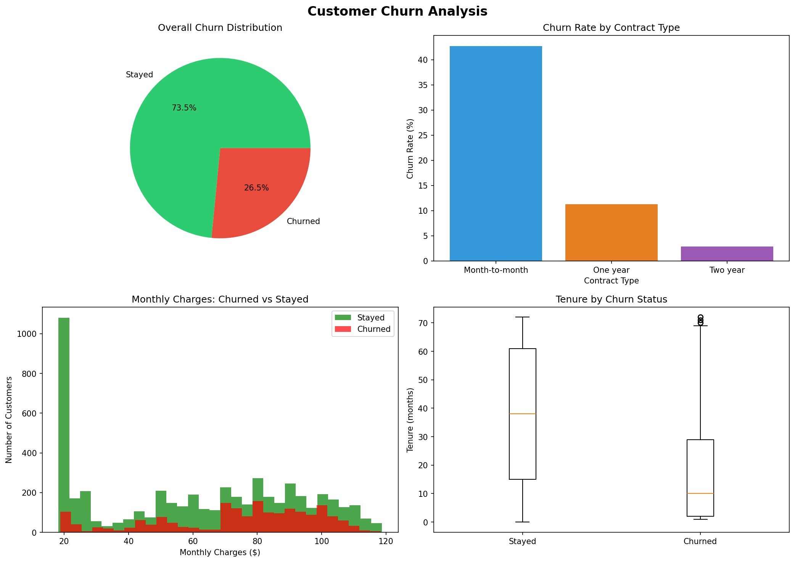

# Customer Churn Analysis

Exploratory Data Analysis on Telco customer churn data
to understand why customers leave and what patterns predict churn.

## Tech Stack
Python | Pandas | NumPy | Matplotlib

## 📊 Key Insights
- Overall churn rate: ~26.5%
- Month-to-month customers churn 14x more than two-year contract customers
- Customers who churn pay ~$13 more per month on average
- Churned customers leave within first 10 months (median tenure)
- Fiber optic internet customers have highest churn rate (~42%)

## Project Structure
```
customer-churn-analysis/
│
├── data/
│   └── telco_churn.csv        ← dataset
├── visuals/
│   └── churn_analysis.png     ← generated charts
└── churn_analysis.ipynb       ← main analysis notebook
```

## How to Run

### 1. Clone the repository
```
git clone https://github.com/jayanthguntuku/customer-churn-analysis.git
cd customer-churn-analysis
```

### 2. Install required libraries
```
pip install pandas numpy matplotlib jupyter
```

### 3. Download the dataset
- Go to https://www.kaggle.com/datasets/blastchar/telco-customer-churn
- Download `WA_Fn-UseC_-Telco-Customer-Churn.csv`
- Rename it to `telco_churn.csv`
- Place it inside the `data/` folder

### 4. Open the notebook
- Open VS Code
- Open `churn_analysis.ipynb`
- Select Python kernel
- Run all cells top to bottom (`Shift + Enter`)

## Sample Charts

